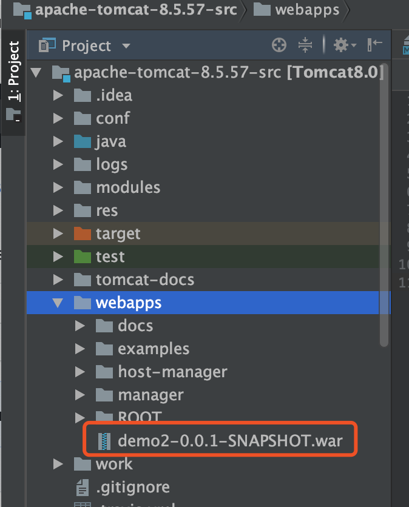
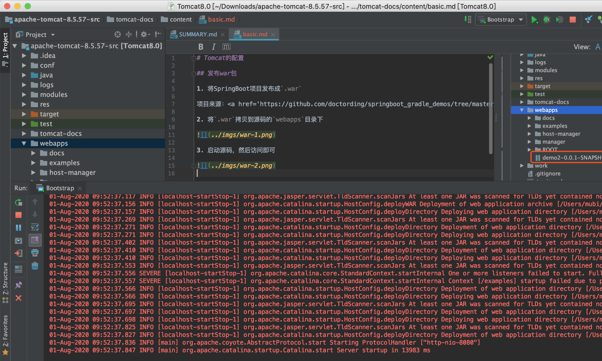
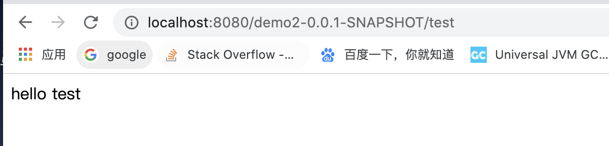
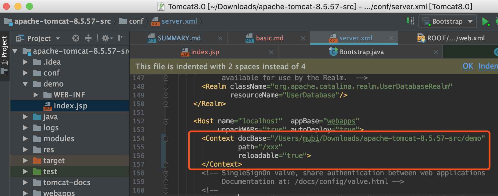
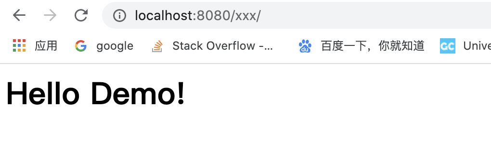
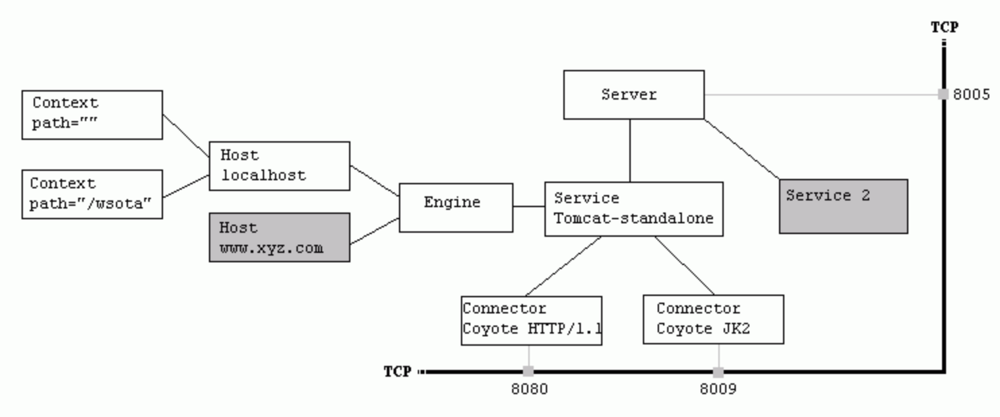

# Tomcat的发布配置

## 如何发布web服务

### 利用war包发布

1. 将SpringBoot项目发布成`.war`

项目来源：<a href='https://github.com/doctording/springboot_gradle_demos/tree/master/code/demo2'>源码链接</a>

2. 将`.war`拷贝到源码的`webapps`目录下



3. 启动源码，然后访问即可





### Host下配置Context发布

* Host下配置Context

```java
<Context docBase="/Users/mubi/Downloads/apache-tomcat-8.5.57-src/demo"
         path="/xxx"
         reloadable="true">
</Context>
```



* 启动源码，然后访问即可



## tomcat配置基础知识

### `conf/server.xml`配置文件结构

```java
<Server>
    <Service>
        <Connector />
        <Connector />
        <Engine>
            <Host>
                <Context /><!-- 现在常常使用自动部署，不推荐配置Context元素，Context小节有详细说明 -->
            </Host>
        </Engine>
    </Service>
</Server>
```


