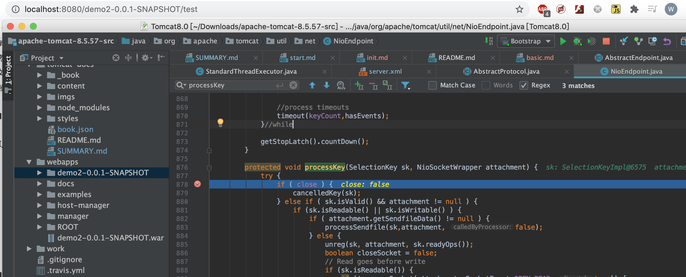
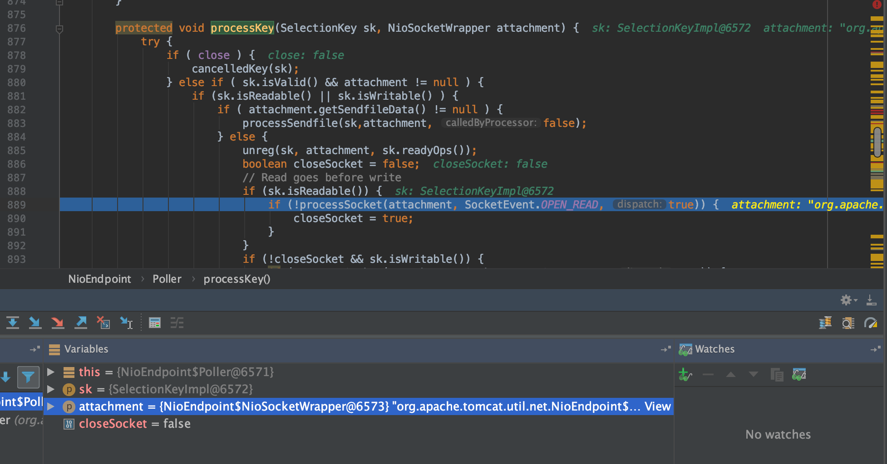
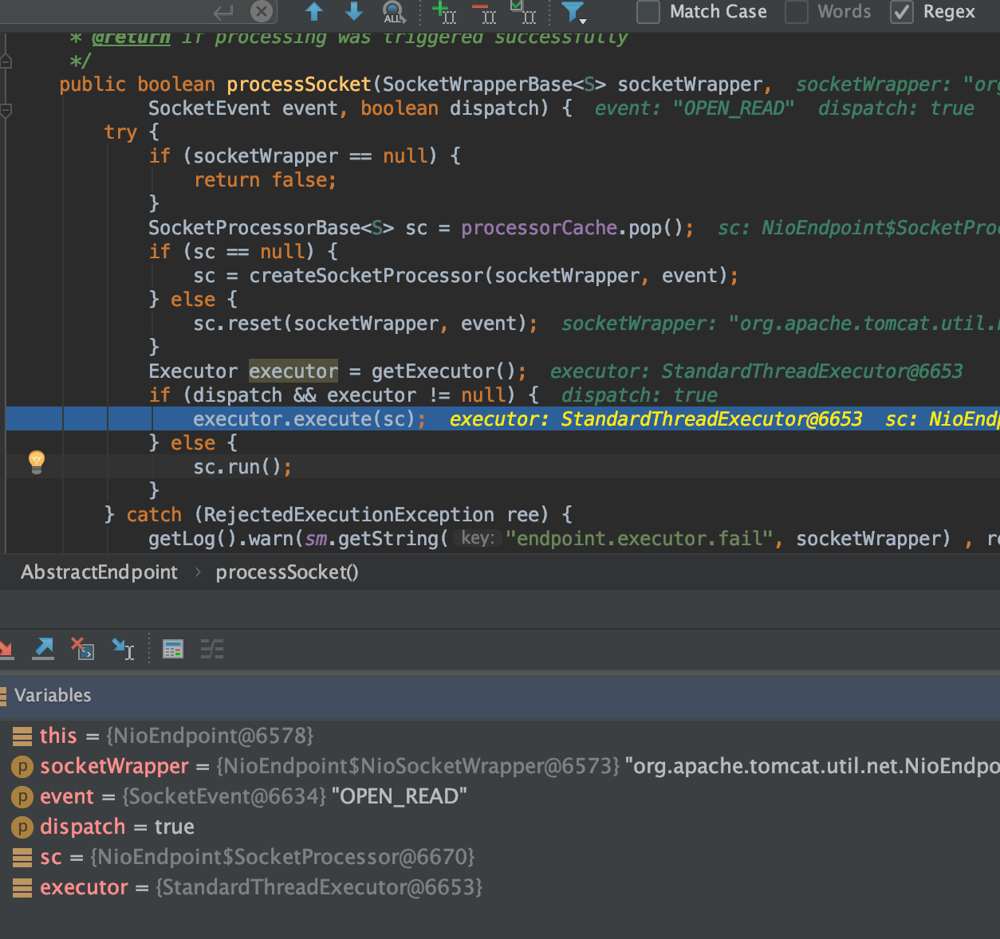
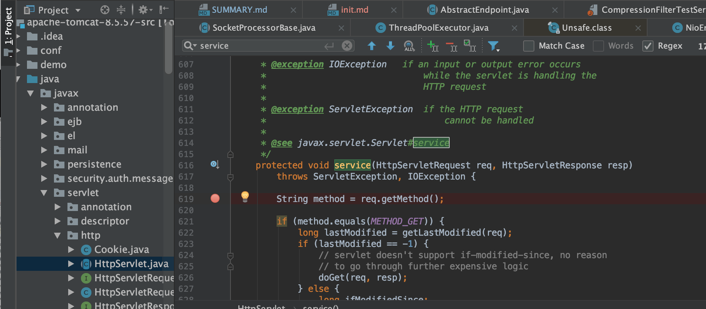
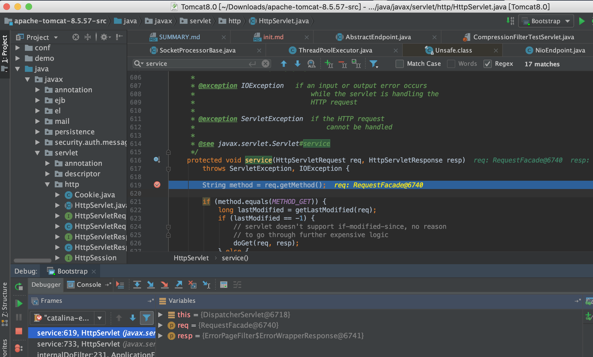
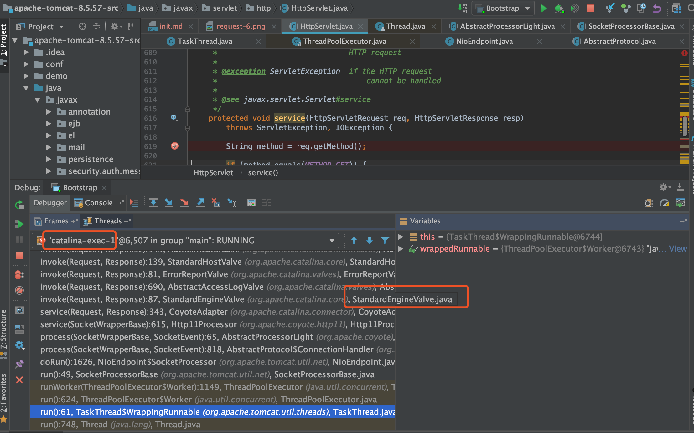
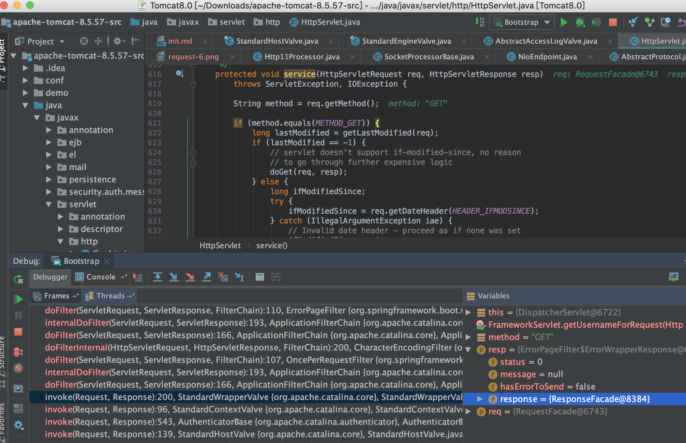

# Tomcat加载web项目和处理请求流程

## 跟踪请求处理流程

直接断点打到Acceptor的`processKey`方法

* 浏览器发起请求

* 处理读请求

* 请求发到Servlet容器的service方法,所以直接HttpServlet service方法断点

* 请求栈（责任链模式）

1. 请求通过线程池去执行，具体是NioEndPoint的doRun方法
2. 会封装SocketWrapperBase,转发到Http11Processor处理
3. 然后再交给Standard的`Engine`（Engine是一个Servlet容器）处理
4. Engine之后可以看到有Standard的`Host`,`Context`,`Wrapper`等处理，中间有各种Filter操作，最后是`Servlet`
5. Servlet容器的HttpServlet类的service方法得到了具体的HttpRequest请求

* 请求处理和返回

