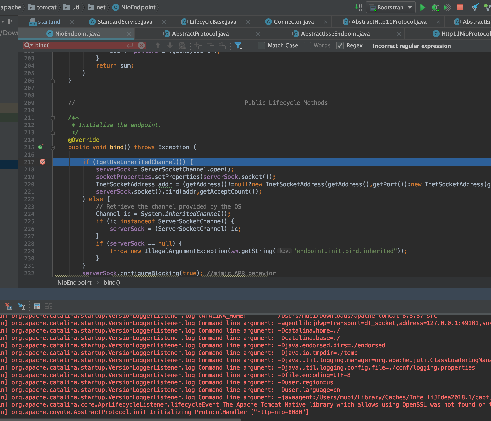
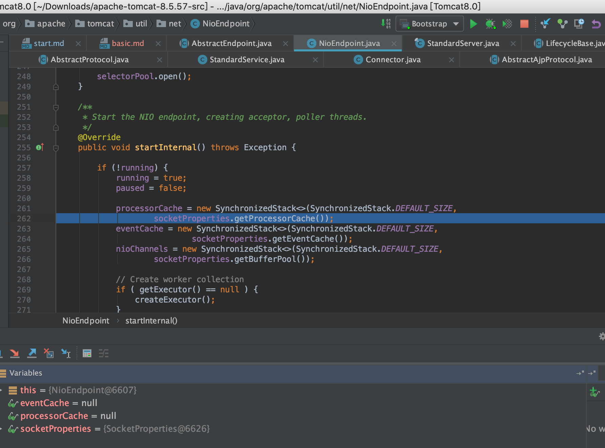
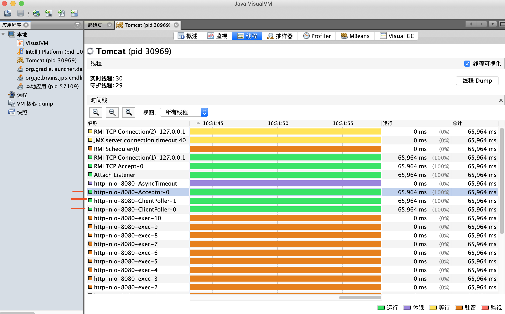
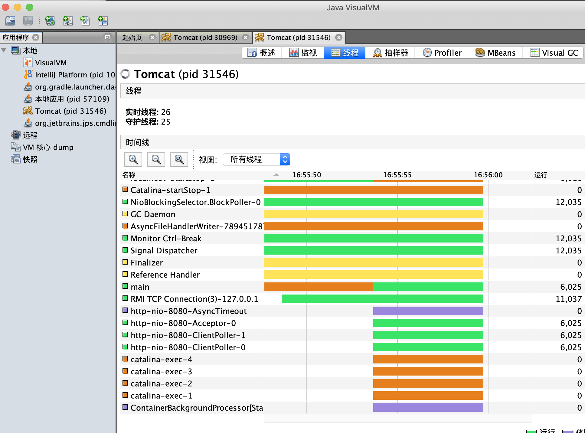

# Tomcat启动流程&架构

## 源码启动流程分析

```java
Bootstrap main
    Catlina load

        // Start the new server
        try {
            getServer().init();
        } catch (LifecycleException e) {
            if (Boolean.getBoolean("org.apache.catalina.startup.EXIT_ON_INIT_FAILURE")) {
                throw new java.lang.Error(e);
            } else {
                log.error("Catalina.start", e);
            }
        }
    
        @Override
        public final synchronized void init() throws LifecycleException {
            if (!state.equals(LifecycleState.NEW)) {
                invalidTransition(Lifecycle.BEFORE_INIT_EVENT);
            }
    
            try {
                setStateInternal(LifecycleState.INITIALIZING, null, false);
                initInternal();
                setStateInternal(LifecycleState.INITIALIZED, null, false);
            } catch (Throwable t) {
                handleSubClassException(t, "lifecycleBase.initFail", toString());
            }
        }
    
    StandardServer initInternal
        service.init();
            StandardService initInternal
                engine.init();
                    StandardEngine initInternal
                        getRealm
                connector.init();
                    Connector initInternal
                        protocolHandler.init();
                            AbstractHttp11Protocol init // tomcat 8默认了NIO方式，控制台可以看到"http-nio-8080"
                                AbstractProtocol init
                                    AbstractEndpoint init
                                         bind();
                                            NioEndpoint bind // ServerSocketChannel
                                                // 默认设置：serverSock.configureBlocking(true);

    Catlina start
        StandardServer startInternal
            engine.start();
            executor.start();
            connector.start();
                Connector startInternal
                    AbstractProtocol start
                        endpoint.start();
                            NioEndpoint startInternal
                                Poller run
                                    selector.select // Selector处理事件
                                         processKey(sk, attachment); // 处理SelectionKey
                                            processSocket(attachment, SocketEvent.OPEN_READ, true) // 处理请求
                                                executor.execute(sc);
                                            processSocket(attachment, SocketEvent.OPEN_WRITE, true) // 响应返回
                                startAcceptorThreads // 默认一个acceptor线程
                                    NioEndpoint的内部类Acceptor run方法
                                        serverSock.accept();
                                            setSocketOptions(socket); // 处理请求，且会重新`socket.configureBlocking(false)`
                                                

```

* 下图所示debug到`NioEndpoint`的bind方法



* 下图所示debug到`NioEndpoint`的创建 acceptor, poller threads



相关源码见：`NioEndpoint`类的`startInternal`方法

```java
/**
 * Start the NIO endpoint, creating acceptor, poller threads.
 */
@Override
public void startInternal() throws Exception {

    if (!running) {
        running = true;
        paused = false;

        processorCache = new SynchronizedStack<>(SynchronizedStack.DEFAULT_SIZE,
                socketProperties.getProcessorCache());
        eventCache = new SynchronizedStack<>(SynchronizedStack.DEFAULT_SIZE,
                        socketProperties.getEventCache());
        nioChannels = new SynchronizedStack<>(SynchronizedStack.DEFAULT_SIZE,
                socketProperties.getBufferPool());

        // Create worker collection
        if ( getExecutor() == null ) {
            createExecutor();
        }

        initializeConnectionLatch();

        // Start poller threads
        pollers = new Poller[getPollerThreadCount()];
        for (int i=0; i<pollers.length; i++) {
            pollers[i] = new Poller();
            Thread pollerThread = new Thread(pollers[i], getName() + "-ClientPoller-"+i);
            pollerThread.setPriority(threadPriority);
            pollerThread.setDaemon(true);
            pollerThread.start();
        }

        startAcceptorThreads();
    }
}
```

### jvisualvm查看tomcat启动后的线程

* 默认1个Acceptor线程
* 默认2个Poller线程



同时看到了10个`http-nio-8080-exex-`线程,这是由于EndPoint默认设置的了`private int minSpareThreads = 10;`

#### Acceptor线程

* 自定义类`LimitLatch`实现了AQS,请求连接过来会先会判断最大连接数

```java
//if we have reached max connections, wait
countUpOrAwaitConnection();
```

* NIOEndpoint中accept一个`SocketChannel`后会复用或构造一个`NioChannel`交给poller线程处理

```java 
protected class Acceptor extends AbstractEndpoint.Acceptor {

    @Override
    public void run() {
    
       int errorDelay = 0;
    
       // Loop until we receive a shutdown command
       while (running) {
    
           // Loop if endpoint is paused
           while (paused && running) {
               state = AcceptorState.PAUSED;
               try {
                   Thread.sleep(50);
               } catch (InterruptedException e) {
                   // Ignore
               }
           }
    
           if (!running) {
               break;
           }
           state = AcceptorState.RUNNING;
    
           try {
               //if we have reached max connections, wait
               countUpOrAwaitConnection();
    
               SocketChannel socket = null;
               try {
                   // Accept the next incoming connection from the server
                   // socket
                   socket = serverSock.accept();
               } catch (IOException ioe) {
                   // We didn't get a socket
                   countDownConnection();
                   if (running) {
                       // Introduce delay if necessary
                       errorDelay = handleExceptionWithDelay(errorDelay);
                       // re-throw
                       throw ioe;
                   } else {
                       break;
                   }
               }
               // Successful accept, reset the error delay
               errorDelay = 0;
    
               // Configure the socket
               if (running && !paused) {
                   // setSocketOptions() will hand the socket off to
                   // an appropriate processor if successful
                   if (!setSocketOptions(socket)) {
                       closeSocket(socket);
                   }
               } else {
                   closeSocket(socket);
               }
           } catch (Throwable t) {
               ExceptionUtils.handleThrowable(t);
               log.error(sm.getString("endpoint.accept.fail"), t);
           }
       }
       state = AcceptorState.ENDED;
    }
```

#### Poller线程

Poller线程主要用于以较少的资源轮询已连接套接字以保持连接，当数据可用时转给工作线程

* 如下注册`NioChannel`到Poller事件同步队列中`SynchronizedQueue<PollerEvent> events`

```java
 /**
 * Registers a newly created socket with the poller.
 *
 * @param socket    The newly created socket
 */
public void register(final NioChannel socket) {
    socket.setPoller(this);
    NioSocketWrapper ka = new NioSocketWrapper(socket, NioEndpoint.this);
    socket.setSocketWrapper(ka);
    ka.setPoller(this);
    ka.setReadTimeout(getSocketProperties().getSoTimeout());
    ka.setWriteTimeout(getSocketProperties().getSoTimeout());
    ka.setKeepAliveLeft(NioEndpoint.this.getMaxKeepAliveRequests());
    ka.setReadTimeout(getConnectionTimeout());
    ka.setWriteTimeout(getConnectionTimeout());
    PollerEvent r = eventCache.pop();
    ka.interestOps(SelectionKey.OP_READ);//this is what OP_REGISTER turns into.
    if ( r==null) r = new PollerEvent(socket,ka,OP_REGISTER);
    else r.reset(socket,ka,OP_REGISTER);
    addEvent(r);
}
```

* Poller线程的run方法,把客户端Socket以事件的方式交给Tomcat工作线程池

采用`Selector`得到`Set<SelectionKey>`,并遍历交给`processKey`方法去真正处理对应的`SelectionKey`

```java
 /**
 * The background thread that adds sockets to the Poller, checks the
 * poller for triggered events and hands the associated socket off to an
 * appropriate processor as events occur.
 */
@Override
public void run() {
    // Loop until destroy() is called
    while (true) {

        boolean hasEvents = false;

        try {
            if (!close) {
                hasEvents = events();
                if (wakeupCounter.getAndSet(-1) > 0) {
                    //if we are here, means we have other stuff to do
                    //do a non blocking select
                    keyCount = selector.selectNow();
                } else {
                    keyCount = selector.select(selectorTimeout);
                }
                wakeupCounter.set(0);
            }
            if (close) {
                events();
                timeout(0, false);
                try {
                    selector.close();
                } catch (IOException ioe) {
                    log.error(sm.getString("endpoint.nio.selectorCloseFail"), ioe);
                }
                break;
            }
        } catch (Throwable x) {
            ExceptionUtils.handleThrowable(x);
            log.error("",x);
            continue;
        }
        //either we timed out or we woke up, process events first
        if ( keyCount == 0 ) hasEvents = (hasEvents | events());

        Iterator<SelectionKey> iterator =
            keyCount > 0 ? selector.selectedKeys().iterator() : null;
        // Walk through the collection of ready keys and dispatch
        // any active event.
        while (iterator != null && iterator.hasNext()) {
            SelectionKey sk = iterator.next();
            NioSocketWrapper attachment = (NioSocketWrapper)sk.attachment();
            // Attachment may be null if another thread has called
            // cancelledKey()
            if (attachment == null) {
                iterator.remove();
            } else {
                iterator.remove();
                processKey(sk, attachment);
            }
        }//while

        //process timeouts
        timeout(keyCount,hasEvents);
    }//while

    getStopLatch().countDown();
}

protected void processKey(SelectionKey sk, NioSocketWrapper attachment) {
    try {
        if ( close ) {
            cancelledKey(sk);
        } else if ( sk.isValid() && attachment != null ) {
            if (sk.isReadable() || sk.isWritable() ) {
                if ( attachment.getSendfileData() != null ) {
                    processSendfile(sk,attachment, false);
                } else {
                    unreg(sk, attachment, sk.readyOps());
                    boolean closeSocket = false;
                    // Read goes before write
                    if (sk.isReadable()) {
                        if (!processSocket(attachment, SocketEvent.OPEN_READ, true)) {
                            closeSocket = true;
                        }
                    }
                    if (!closeSocket && sk.isWritable()) {
                        if (!processSocket(attachment, SocketEvent.OPEN_WRITE, true)) {
                            closeSocket = true;
                        }
                    }
                    if (closeSocket) {
                        cancelledKey(sk);
                    }
                }
            }
        } else {
            //invalid key
            cancelledKey(sk);
        }
    } catch ( CancelledKeyException ckx ) {
        cancelledKey(sk);
    } catch (Throwable t) {
        ExceptionUtils.handleThrowable(t);
        log.error("",t);
    }
}
```

* dispatch为true，交给工作线程池去处理读写事件

```java
if (sk.isReadable()) {
    if (!processSocket(attachment, SocketEvent.OPEN_READ, true)) {
        closeSocket = true;
    }
}
if (!closeSocket && sk.isWritable()) {
    if (!processSocket(attachment, SocketEvent.OPEN_WRITE, true)) {
        closeSocket = true;
    }
}
```

#### Tomcat工作线程池会处理客户端Socket的读写事件

```java
 /**
 * Process the given SocketWrapper with the given status. Used to trigger
 * processing as if the Poller (for those endpoints that have one)
 * selected the socket.
 *
 * @param socketWrapper The socket wrapper to process
 * @param event         The socket event to be processed
 * @param dispatch      Should the processing be performed on a new
 *                          container thread
 *
 * @return if processing was triggered successfully
 */
public boolean processSocket(SocketWrapperBase<S> socketWrapper,
        SocketEvent event, boolean dispatch) {
    try {
        if (socketWrapper == null) {
            return false;
        }
        SocketProcessorBase<S> sc = processorCache.pop();
        if (sc == null) {
            sc = createSocketProcessor(socketWrapper, event);
        } else {
            sc.reset(socketWrapper, event);
        }
        Executor executor = getExecutor();
        if (dispatch && executor != null) {
            executor.execute(sc);
        } else {
            sc.run();
        }
    } catch (RejectedExecutionException ree) {
        getLog().warn(sm.getString("endpoint.executor.fail", socketWrapper) , ree);
        return false;
    } catch (Throwable t) {
        ExceptionUtils.handleThrowable(t);
        // This means we got an OOM or similar creating a thread, or that
        // the pool and its queue are full
        getLog().error(sm.getString("endpoint.process.fail"), t);
        return false;
    }
    return true;
}
```

##### NioEndpoint的线程池

* JDk提供自带的`ThreadPoolExecutor`
* 队列使用了`LinkedBlockingQueue<Runnable>`（线程安全的阻塞队列）
* 采用默认的`RejectHandler`拒绝策略
* 线程工厂使用`TaskThreadFactory`

```java
public void createExecutor() {
    internalExecutor = true;
    TaskQueue taskqueue = new TaskQueue();
    TaskThreadFactory tf = new TaskThreadFactory(getName() + "-exec-", daemon, getThreadPriority());
    executor = new ThreadPoolExecutor(getMinSpareThreads(), getMaxThreads(), 60, TimeUnit.SECONDS,taskqueue, tf);
    taskqueue.setParent( (ThreadPoolExecutor) executor);
}
```

* 关于线程池构造的线程名字

可以在tomcat配置文件中配置`namePrefix`，或者是程序默认如下(例如nio的:`http-nio-8080`)

```java
AbstractProtocol 类的 getName 方法

/**
 * The name will be prefix-address-port if address is non-null and
 * prefix-port if the address is null.
 *
 * @return A name for this protocol instance that is appropriately quoted
 *         for use in an ObjectName.
 */
public String getName() {
    return ObjectName.quote(getNameInternal());
}

private String getNameInternal() {
    StringBuilder name = new StringBuilder(getNamePrefix());
    name.append('-');
    if (getAddress() != null) {
        name.append(getAddress().getHostAddress());
        name.append('-');
    }
    int port = getPort();
    if (port == 0) {
        // Auto binding is in use. Check if port is known
        name.append("auto-");
        name.append(getNameIndex());
        port = getLocalPort();
        if (port != -1) {
            name.append('-');
            name.append(port);
        }
    } else {
        name.append(port);
    }
    return name.toString();
}
```

### 自己设置Tomcat的线程池

```java
<Executor name="tomcatThreadPool" namePrefix="catalina-exec-"
          maxThreads="150" minSpareThreads="4"/>
-->

<!-- A "Connector" represents an endpoint by which requests are received
     and responses are returned. Documentation at :
     Java HTTP Connector: /docs/config/http.html
     Java AJP  Connector: /docs/config/ajp.html
     APR (HTTP/AJP) Connector: /docs/apr.html
     Define a non-SSL/TLS HTTP/1.1 Connector on port 8080
-->
<Connector port="8080" protocol="HTTP/1.1" executor="tomcatThreadPool"
           connectionTimeout="20000"
           redirectPort="8443" />
```



#### 附加：public abstract class LifecycleBase implements Lifecycle

* Lifecycle接口统一管理Tomcat生命周期

```java
public interface Lifecycle {
    // 13个状态常量值
    public static final String BEFORE_INIT_EVENT = "before_init";
    public static final String AFTER_INIT_EVENT = "after_init";
    public static final String START_EVENT = "start";
    public static final String BEFORE_START_EVENT = "before_start";
    public static final String AFTER_START_EVENT = "after_start";
    public static final String STOP_EVENT = "stop";
    public static final String BEFORE_STOP_EVENT = "before_stop";
    public static final String AFTER_STOP_EVENT = "after_stop";
    public static final String AFTER_DESTROY_EVENT = "after_destroy";
    public static final String BEFORE_DESTROY_EVENT = "before_destroy";
    public static final String PERIODIC_EVENT = "periodic";
    public static final String CONFIGURE_START_EVENT = "configure_start";
    public static final String CONFIGURE_STOP_EVENT = "configure_stop";
    // 3个监听器方法
    public void addLifecycleListener(LifecycleListener listener);
    public LifecycleListener[] findLifecycleListeners();
    public void removeLifecycleListener(LifecycleListener listener);
    // 4个生命周期方法
    public void init() throws LifecycleException;
    public void start() throws LifecycleException;
    public void stop() throws LifecycleException;
    public void destroy() throws LifecycleException;
    // 2个当前状态方法
    public LifecycleState getState();
    public String getStateName();
```

* ​LifecycleBase 类则是Lifecycle 接口的默认实现
